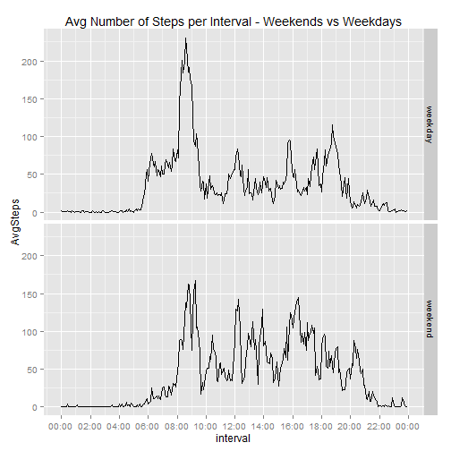

This R Markdown document shows the code and output for PeerAssessment1, Reproducible Research.

**Loading and preprocessing the data**

(Assumes that the data is in your working directory)


```r
activity<-read.csv("activity/activity.csv")
dim(activity)
```

```
## [1] 17568     3
```

Please load the following packages for this analysis:


```r
library(lubridate)
library(stringr)
library(ggplot2)
require(scales)
library(dplyr)
```

Convert "interval" to a formatted POSXIct Date type and convert "date" to a Date:


```r
activity$interval<-str_pad(activity$interval, 4, pad = "0")
activity$interval<-as.POSIXct(activity$interval, format =  "%H%M")
activity$date<-as.Date(activity$date)
str(activity)
```

```
## 'data.frame':	17568 obs. of  3 variables:
##  $ steps   : int  NA NA NA NA NA NA NA NA NA NA ...
##  $ date    : Date, format: "2012-10-01" "2012-10-01" ...
##  $ interval: POSIXct, format: "2015-05-17 00:00:00" "2015-05-17 00:05:00" ...
```
*Note that interval must have a date attached to it since it is a POSIXct type, but this date is meaningless for analysis purposes and will be omitted from the graphs with proper formatting.


**What is the mean of the total steps taken per day?**

(Ignore missing values in the dataset)


```r
activitycomplete<-activity[complete.cases(activity),]
per_day = group_by(activitycomplete, date)
total_steps_per_day<-summarise(per_day, TotalSteps = sum(steps, na.rm = TRUE))
hist(total_steps_per_day$TotalSteps, breaks = 8, col = "blue", xlab = "Total Steps", 
     main = "Histogram of Total Number of Steps Per Day")
```

 

```r
options(scipen = 999999, digits = 6)
mean_steps_per_day<-round(mean(total_steps_per_day$TotalSteps),1)
mean_steps_per_day
```

```
## [1] 10766.2
```

```r
median_steps_per_day<-median(total_steps_per_day$TotalSteps)
median_steps_per_day
```

```
## [1] 10765
```

So the mean number of steps per day is 10766.2 and the median number of steps per day is 10765. 

**What is the average daily activity pattern?**


```r
per_interval = group_by(activitycomplete, interval)
avg_steps_per_interval <- summarise(per_interval, AvgSteps = mean(steps, na.rm = TRUE))
with(avg_steps_per_interval, plot(interval, AvgSteps, type = "l", 
                                  main = "Average Number of Steps Per Interval", 
                                 las = 2))
```

 

```r
maxstepsinterval<-format(avg_steps_per_interval$interval[which(avg_steps_per_interval$AvgSteps == max(avg_steps_per_interval$AvgSteps))], "%H:%M")
```

The five minute interval with the maximum number of steps is 08:35. 

**Imputing missing values**

Calculate and report missing values in dataset:


```r
sum(!(complete.cases(activity)))
```

```
## [1] 2304
```

Strategy: Fill in  NA's with average steps per interval


```r
activity_avgstepsperint<-merge(activity, avg_steps_per_interval)
activity_avgstepsperint$stepsnew <- activity_avgstepsperint$steps
my.na<-is.na(activity_avgstepsperint$steps)
activity_avgstepsperint$stepsnew[my.na]<-activity_avgstepsperint$AvgSteps[my.na]

per_day_imputed = group_by(activity_avgstepsperint, date)
total_steps_per_day_imputed<-summarise(per_day_imputed, TotalSteps = sum(stepsnew, na.rm = TRUE))
hist(total_steps_per_day_imputed$TotalSteps, breaks = 8, col = "blue", xlab = "Total Steps", 
     main = "Histogram of Total Number of Steps Per Day With Imputed Values", ylim = c(0,30))
```

 

```r
options(scipen = 999999, digits = 6)
mean_steps_per_day_imputed<-mean(total_steps_per_day_imputed$TotalSteps)
mean_steps_per_day_imputed
```

```
## [1] 10766.2
```

```r
median_steps_per_day_imputed<-median(total_steps_per_day_imputed$TotalSteps)
median_steps_per_day_imputed
```

```
## [1] 10766.2
```

What is the impact of imputing missing data on the estimates of the total daily number of steps?

Because of the way the missing values were imputed (using the avg for that 5 minute interval), the mean and median do not change very  much at all. The only difference is that the median becomes the same value as the mean, because the mean value is now an actual data value in the data set, total_steps_per_day_imputed, that is repeated whenever a day has missing values. This also creates a spike in the new histogram in the bin containing  the mean value. Other than this spike, the histograms are the same.


**Are there differences in activity patterns between weekdays and weekends?**


```r
activity_avgstepsperint<-mutate(activity_avgstepsperint, 
                      Wday = ifelse(weekdays(date) %in% c("Saturday", "Sunday"), "weekend", "weekday" ))
activity_avgstepsperint <-transform(activity_avgstepsperint, Wday = factor(Wday))

per_interval_imputed = group_by(activity_avgstepsperint, interval, Wday)
avg_steps_per_interval_imputed <- summarise(per_interval_imputed, AvgSteps = mean(stepsnew, na.rm = TRUE))

g<- ggplot(avg_steps_per_interval_imputed, aes(interval, AvgSteps)) + geom_line() 
g<- g + scale_x_datetime(labels = date_format("%H:%M"), breaks = date_breaks("2 hour"))
g + facet_grid(Wday ~.) + labs(title = "Avg Number of Steps per Interval - Weekends vs Weekdays")
```

 

Yes, it appears that the steps are much more evenly distributed across the daytime hours on the weekends.
